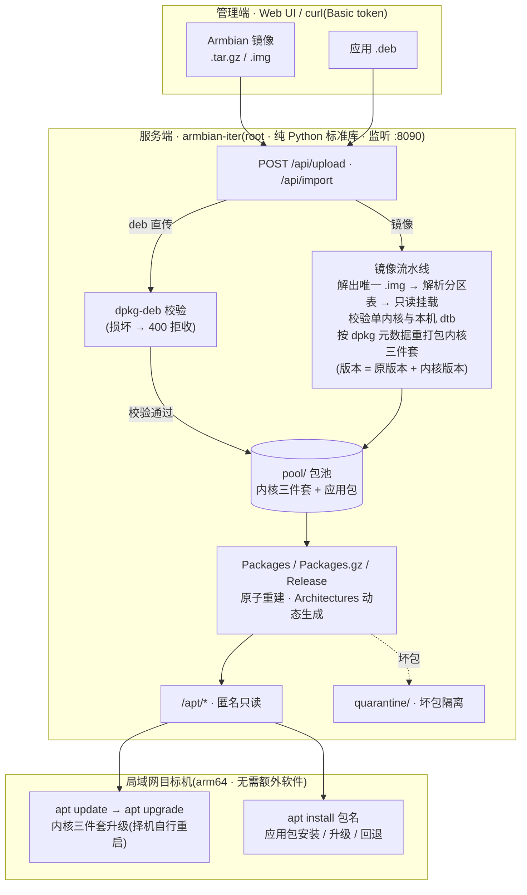

# Armbian Iter — 局域网内核迭代 APT 仓库


[](https://github.com/Fen9pi-Max/armbian-iter/actions/workflows/ui-test.yml)

单文件、仅 Python 标准库的局域网 APT 仓库服务。上传 Armbian 镜像(`.tar.gz` / `.img`),
服务自动只读挂载镜像,依据镜像内 dpkg 元数据把**内核三件套**
(`linux-image` / `linux-dtb` / `linux-headers`,rockchip64 edge)重打包为标准 `.deb`,
建立 `Packages` / `Release` 索引,通过 HTTP 向局域网提供 apt 源。

之后在**任何同板型设备**上三行命令接入,内核迭代像普通软件升级一样分发:

```bash
echo 'deb [trusted=yes] http://<服务器IP>:8090/apt ./' | sudo tee /etc/apt/sources.list.d/armbian-iter.list
sudo apt update
sudo apt upgrade        # 升级内核后重启生效,服务端绝不远程重启客户端
```

主要针对 **Skysi-X5(RK3588 / Armbian rockchip64 edge)** 场景,亦可用于任何单内核 arm64
Armbian 镜像(通过 `fdtfile` 配置适配板型)。

## 功能特性

- **零第三方依赖**:服务端仅 Python 3 标准库 + 系统自带工具(`losetup`/`mount`/`tar`/`dpkg-deb`)。
- **镜像 → deb 全自动**:解压压缩包 → 解析 GPT/MBR 找到 Linux 分区 → 只读 loop 挂载 →
  按 `var/lib/dpkg` 元数据(文件清单、维护脚本)重打包,版本追加 `+<内核版本>`。
- **标准 apt 仓库**:自动生成并原子更新 `Packages` / `Packages.gz` / `Release`(MD5/SHA1/SHA256 校验和)。
- **内置 Web 管理台**:上传 / 本地导入 / 自打包基线 / 删除包 / 查看工件状态与服务日志,5 秒自动刷新。
- **安全边界明确**:`/apt/*` 匿名只读(带路径穿越防护),一切管理接口需 token(Basic 认证);
  绝不自动重启;绝不写入 `/root/armbain` 工作区。
- **回滚友好**:每个 deb 版本号内嵌内核版本,可 `apt install pkg=version --allow-downgrades`
  精确回退;"自打包"可把当前已装内核打包入池作为基线。
- **应用包直传分发**:任意应用 `.deb` 直接上传入池(上传时 `dpkg-deb` 校验,坏包拒收;
  索引重建时发现的坏包自动隔离),目标机 `apt install 包名` 即装;多版本共存,升降级
  与内核包一致。
- **大文件分块上传**:Web 端超过 16 MB 的文件自动按 16 MB 分块,单块网络闪断自动重试、
  **不从头重传**,实时显示进度与速率;上传中断(断线/超时/磁盘满)一律记日志、清残留、
  给前端明确提示,服务线程永不因上传失败裸崩。

## 工作原理



## 快速开始

**服务端**(详见 [docs/server.md](docs/server.md)):

```bash
sudo python3 app.py          # 需要 root(losetup/mount);首次启动自动生成 token
cat /etc/armbian-iter.conf   # 查看 token 与端口
```

浏览器打开 `http://<服务器IP>:8090/`,用 token 登录,上传镜像即可。

**客户端**(详见 [docs/client.md](docs/client.md)):

```bash
echo 'deb [trusted=yes] http://<服务器IP>:8090/apt ./' | sudo tee /etc/apt/sources.list.d/armbian-iter.list
sudo apt update
apt list --upgradable        # 查看可升级的内核三件套
sudo apt upgrade             # 完成后择机重启
sudo apt install <应用包名>   # 安装任意直传入池的应用 deb
```

## 文档

| 文档 | 内容 |
| --- | --- |
| [docs/server.md](docs/server.md) | 服务端部署、配置、目录布局、HTTP API 参考、常见问题 |
| [docs/client.md](docs/client.md) | 客户端接入、升级、回滚、卸载、常见问题 |

## 运行要求

- 服务端:Linux(root 权限),Python ≥ 3.8,`losetup` `mount` `tar` `dpkg-deb`;
  磁盘空闲 ≥ 上传镜像体积 + ~8 GB。
- 客户端:任意 Debian/Armbian arm64 设备,`apt` 即可,无需额外软件。

## 项目结构

```
app.py            # 全部实现(服务、重打包、索引、Web UI),单文件
README.md
docs/server.md    # 服务端文档
docs/client.md    # 客户端文档
LICENSE
```

运行时数据(与代码目录无关,均在配置指定路径):

```
/etc/armbian-iter.conf           # 配置(token / port / fdtfile …),0600
/srv/armbian-iter/repo/          # apt 仓库根(Packages/Release/pool/)
/srv/armbian-iter/artifacts/     # 上传的镜像工件与元数据
/srv/armbian-iter/logs/          # 滚动服务日志
```

## 安全模型

- `/apt/**` 匿名只读,且严格限制在仓库根目录内(防路径穿越);不含管理操作。
- 其余全部接口(状态、上传、删除、日志……)需要 Basic 认证,密码为启动时随机生成的 token
  (`secrets.token_urlsafe(18)`,常量时间比较)。
- 服务**绝不**主动重启任何机器;内核升级后由管理员在客户端择机重启。
- 镜像只读挂载,处理失败不影响镜像工件本身,可删除重传或 `reprocess` 重试。

## 测试

`tests/ui_test.py` 用 Playwright + 真实 Chromium 对 Web UI 做端到端测试:自起沙箱服务
(`ITER_CONF` / `ITER_BASE` 指向临时目录,不碰系统路径),覆盖页面加载、.deb 上传 /
本地导入 / 删除重建索引、坏包拒收、apt 索引一致性,并把**零 JS 异常、零控制台错误**
作为硬性门槛——页面曾因一处 JS 字符串跨行导致整段脚本解析失败、所有按钮失效,
此门槛专门防止同类回归。

```bash
pip install playwright && playwright install --with-deps chromium
python3 tests/ui_test.py
```

GitHub Actions 在每次推送时自动运行([.github/workflows/ui-test.yml](.github/workflows/ui-test.yml))。

## License

[MIT](LICENSE)
